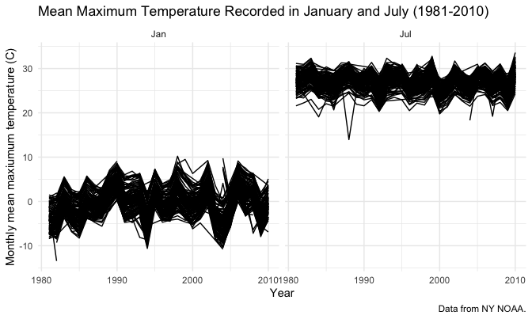

p8105_hw3_amz2148
================

Data Science: Homework 3

# Problem 0

``` r
library(tidyverse) #loads tidyverse package
```

    ## ── Attaching packages ─────────────────────────────────────── tidyverse 1.3.2 ──
    ## ✔ ggplot2 3.3.6      ✔ purrr   0.3.5 
    ## ✔ tibble  3.1.8      ✔ dplyr   1.0.10
    ## ✔ tidyr   1.2.0      ✔ stringr 1.4.1 
    ## ✔ readr   2.1.3      ✔ forcats 0.5.2 
    ## ── Conflicts ────────────────────────────────────────── tidyverse_conflicts() ──
    ## ✖ dplyr::filter() masks stats::filter()
    ## ✖ dplyr::lag()    masks stats::lag()

``` r
library(patchwork) #loads patchwork package
library(ggridges) #loads ggridges package
```

``` r
knitr::opts_chunk$set(echo = TRUE) #shows all code chunks
knitr::opts_chunk$set(
  fig.width = 7,
  fig.asp = .6,
  out.width = "90%") #sets figure dimensions

theme_set(theme_minimal() + theme(legend.position = "bottom")) #sets default figure theme
```

# Problem 1

Problem 1 code fixed/updated using code answer key provided by
Dr. Goldsmith.

First, we load the `instacart` data from the `p8105.datasets` package.

``` r
library(p8105.datasets) #loads p8105.datasets package
data("instacart") #loads instacart data

instacart = 
  instacart %>% 
  as_tibble(instacart)
```

Next, we find the number of aisles and identify from which aisles the
most items are ordered.

``` r
instacart %>%
  count(aisle) %>% #counts aisles
  arrange(desc(n)) #arranges data by descending frequency of number of items ordered from each aisle
```

    ## # A tibble: 134 × 2
    ##    aisle                              n
    ##    <chr>                          <int>
    ##  1 fresh vegetables              150609
    ##  2 fresh fruits                  150473
    ##  3 packaged vegetables fruits     78493
    ##  4 yogurt                         55240
    ##  5 packaged cheese                41699
    ##  6 water seltzer sparkling water  36617
    ##  7 milk                           32644
    ##  8 chips pretzels                 31269
    ##  9 soy lactosefree                26240
    ## 10 bread                          23635
    ## # … with 124 more rows

Then, we plot number of items ordered in each aisle, limited to aisles
with \>10000 items ordered.

``` r
instacart %>% 
  count(aisle) %>% #counts aisles
  filter(n > 10000) %>% #keeps only observations with >1000 items ordered
  mutate(aisle = fct_reorder(aisle, n)) %>% #reorders by aisle variable based on ascending values for n
  ggplot(aes(x = aisle, y = n)) + #creates ggplot of n vs. aisle
  geom_point() + #adds scatterplot
  labs(title = "Number of items ordered by aisle") + #adds title
  theme(axis.text.x = element_text(angle = 60, hjust = 1)) #rotates x axis labels
```


Then, we make a table showing the three most popular items in each of
the following aisles: `baking ingredients`, `dog food care`, and
`packaged vegetables fruits` (including the number of times each item
was ordered).

``` r
instacart %>% 
  filter(
    aisle == "baking ingredients" | 
    aisle == "dog food care" | 
    aisle == "packaged vegetables fruits") %>% #only keeps data from 3 aisles
  group_by(aisle) %>% #groups data by aisle
  count(product_name) %>% #counts frequency of product names
  mutate(rank = min_rank(desc(n))) %>% #ranks by descending frequency of product names
  filter(rank < 4) %>% #keeps only data with top 3 ranks
  arrange(desc(n)) %>% #arranges data by descending frequency of product names
  knitr::kable() #creates table
```

| aisle                      | product_name                                  |    n | rank |
|:---------------------------|:----------------------------------------------|-----:|-----:|
| packaged vegetables fruits | Organic Baby Spinach                          | 9784 |    1 |
| packaged vegetables fruits | Organic Raspberries                           | 5546 |    2 |
| packaged vegetables fruits | Organic Blueberries                           | 4966 |    3 |
| baking ingredients         | Light Brown Sugar                             |  499 |    1 |
| baking ingredients         | Pure Baking Soda                              |  387 |    2 |
| baking ingredients         | Cane Sugar                                    |  336 |    3 |
| dog food care              | Snack Sticks Chicken & Rice Recipe Dog Treats |   30 |    1 |
| dog food care              | Organix Chicken & Brown Rice Recipe           |   28 |    2 |
| dog food care              | Small Dog Biscuits                            |   26 |    3 |

Finally, we make a 2 x 7 table showing the mean hour of the day at which
`Pink Lady Apples` and `Coffee Ice Cream` are ordered on each day of the
week.

``` r
instacart %>%
  filter(
    product_name == "Pink Lady Apples" | 
    product_name == "Coffee Ice Cream") %>% #keeps only pink lady apple and coffee ice cream observations
  group_by(product_name, order_dow) %>% #groups data by product name and order day of the week
  summarize(mean_hour = mean(order_hour_of_day)) %>% #calculates mean hour from order_hour_of_day variable
  pivot_wider(
  names_from = "order_dow", 
  values_from = "mean_hour") %>% #pivots wider to make seperate columns for day of the week containing the mean hour associated with each
  knitr::kable(digits = 2) #creates table
```

    ## `summarise()` has grouped output by 'product_name'. You can override using the
    ## `.groups` argument.

| product_name     |     0 |     1 |     2 |     3 |     4 |     5 |     6 |
|:-----------------|------:|------:|------:|------:|------:|------:|------:|
| Coffee Ice Cream | 13.77 | 14.32 | 15.38 | 15.32 | 15.22 | 12.26 | 13.83 |
| Pink Lady Apples | 13.44 | 11.36 | 11.70 | 14.25 | 11.55 | 12.78 | 11.94 |

# Problem 2

First, we load, tidy, and otherwise wrangle the data. The final dataset
includes all originally observed variables and values; has useful
variable names (e.g., the `activity_1` to `activity_1440` variables are
converted to just 2 variables `minute` and `activity_lvl`); include a
weekday vs weekend variable (`day_type`); and encodes data with
reasonable variable classes (e.g., `day` as a factor, `minute` as a
numeric variable).

``` r
activity = 
  read_csv("data/accel_data.csv") %>% #loads csv file
  janitor::clean_names() %>% #cleans variable names
    pivot_longer(
    activity_1:activity_1440,
    names_to = "minute", 
    values_to = "activity_lvl") %>% #tidies data into long format
  mutate(day_type = case_when(day == "Saturday" | day == "Sunday" ~ "weekend", day != "Saturday" | day == "Sunday" ~ "weekday")) %>% #creates day_type variable
  mutate(minute = gsub("[A-z]","",minute))  %>% #removes "activity_" prefix from minute variable
  mutate(day = as.factor(day), day_type = as.factor(day_type), minute = as.numeric(minute)) %>% #converts character variables to factor or numeric
  select(week, day_id, day, day_type, minute, activity_lvl) %>% #reorders columns
  arrange(week, day_id, minute) #arranges data by values of certain variables
```

    ## Rows: 35 Columns: 1443
    ## ── Column specification ────────────────────────────────────────────────────────
    ## Delimiter: ","
    ## chr    (1): day
    ## dbl (1442): week, day_id, activity.1, activity.2, activity.3, activity.4, ac...
    ## 
    ## ℹ Use `spec()` to retrieve the full column specification for this data.
    ## ℹ Specify the column types or set `show_col_types = FALSE` to quiet this message.

In the resulting dataset, there are `50400` rows (observations) and `6`
columns (variables). The variables’ names are
`week, day_id, day, day_type, minute, activity_lvl`. The `week` variable
assigns a numeric value to which week the observation is from, ranging
from `1` to `5`. The `day_id` variable assigns a numeric value to which
day the observation is from, ranging from `1` to `35`. The `day`
variable states the day of the week associated with the observation and
`day_type` states whether the observation occurred on a weekday or
weekend. The `minute` variable shows what minute of the day the
observation is from, ranging from `1` (starting at midnight) to `1440`
(ending just before the subsequent midnight). Finally, the
`activity_lvl` variable (ranging from `1` units to `8982` units with a
median of `74` units) gives the activity count associated with each
observation as measured by the accelerometer.

Traditional analyses of accelerometer data focus on the total activity
over the day. Using the tidied dataset, we aggregate across minutes to
create a total activity variable for each day, and create a table
showing these totals.

``` r
activity %>% 
  mutate(day = factor(day, levels = c("Sunday", "Monday", "Tuesday", "Wednesday", "Thursday", "Friday", "Saturday"))) %>% #makes day a factor variable with defined ordering/levels
  group_by(week, day) %>% #groups data by week and day
  summarize(
    total_activity = sum(activity_lvl)) %>% #creates total_activity variable (total daily activity count)
  pivot_wider(
    names_from = "day", 
    values_from = "total_activity") %>% #pivots wider to format data as observations=total_activity, rows=week, columns=day
  knitr::kable(digits = 0) #creates table
```

    ## `summarise()` has grouped output by 'week'. You can override using the
    ## `.groups` argument.

| week | Sunday | Monday | Tuesday | Wednesday | Thursday | Friday | Saturday |
|-----:|-------:|-------:|--------:|----------:|---------:|-------:|---------:|
|    1 | 631105 |  78828 |  307094 |    340115 |   355924 | 480543 |   376254 |
|    2 | 422018 | 295431 |  423245 |    440962 |   474048 | 568839 |   607175 |
|    3 | 467052 | 685910 |  381507 |    468869 |   371230 | 467420 |   382928 |
|    4 | 260617 | 409450 |  319568 |    434460 |   340291 | 154049 |     1440 |
|    5 | 138421 | 389080 |  367824 |    445366 |   549658 | 620860 |     1440 |

A table of total daily activity across the examined period reveals a few
possible trends. The days toward the middle of each week (Tuesday,
Wednesday, and Thursday) have fairly consistent, middle-of-the-range
total activity levels (around 400,000 units per day). Meanwhile, the
days at/around the weekend (Friday - Monday) have more variable total
activity levels ranging from both very high (\>600,000 units) to very
low (around or less than 100,000 units). There are also a few days when
likely no activity occurred (Saturdays of weeks 4 and 5), evidenced by
the fact that the total activity level was equal to 1440, which would be
the value outputted if every minute of the day had an activity level of
1 (the lowest possible value). This may mean the individual was not
wearing the accelerometer at the time and thus could be erroneous data.
Furthermore, each week with the exception of week 4 has one day with an
activity level above 600,000 units - suggesting that the day on which
the individual may have not worn the device that week (Saturday) may be
the missing “highly active day” of this week (though this is by no means
proven by the data).

Finally, we create a single-panel plot that shows the 24-hour activity
time courses for each day and uses color to indicate day of the week.

``` r
activity %>% 
  mutate(day = factor(day, levels = c("Sunday", "Monday", "Tuesday", "Wednesday", "Thursday", "Friday", "Saturday"))) %>% #converts day to factor variable with defined order/levels
  group_by(day, minute) %>% #groups data by day and minute
  ggplot(aes(x = minute, y = activity_lvl)) + #creates ggplot of activity_lvl vs. minute
    geom_line(aes(color = day), alpha = .4) + #adds line plot
    theme(legend.position = "bottom") + #adds theme
  labs(
    title = "Activity Count Over Every Minute by Day of the Week",
    x = "Minute",
    y = "Activity Count",
    caption = "Data from Advanced Cardiac Care Center of Columbia University Medical Center.") #adds labels
```


Based on this graph, one can see that most activity count values are
fairly low, generally below \~2500 units each minute. There is also
lower activity seen in the early parts of the day (before \~minute 500)
and at the very end of the day (near the final minute 1440), which
likely indicate the subject was sleeping at these times. Spikes can be
seen throughout the day, but they are primarily clustered around noon
(\~minute 700) and in the evening (\~minute 1250). When examining these
clustered spikes, we can see many noon spikes are attributable to
Sundays and many evening spikes to Fridays. Meanwhile, other smaller
patterns are visible as well, such as consistent medium-level spiking on
Saturdays around minute 1000. These patterns could offer clues about the
subject’s daily habits and activities. For example, it is possible that
the subject usually goes out on Friday nights and walks to lunch on
Sundays. However, it seems less likely that the individual walks or
cycles to work every day as there are no consistent weekday spikes
around 9am (minute 540) and 5pm (1000). But to know detailed information
such as this, we would need to know more about the subject’s activities,
as the graph can only provide suggestions not definitive conclusions,
since many other variables could be contributing to the trends we see
such as whether the subject even consistently wore the accelerometer.

# Problem 3

First, we load the `NY NOAA dataset` from the `p8105.datasets` package.

``` r
library(p8105.datasets) #loads p8105.datasets package
data("ny_noaa", package = "p8105.datasets") #loads ny_noaa dataset
```

Upon loading the `ny_noaa` dataset, before tidying or altering the data
in any way, we see that it contains `2595176` rows (observations) and
`7` columns (variables). The variables’ names are
`id, date, prcp, snow, snwd, tmax, tmin`. The `id` variable contains the
alphanumeric ID of the weather station by which each observation was
recorded, while the `date` variable encodes the date of the observation.
`prcp` gives precipitation in tenths of mm, `snow` gives snowfall in mm,
`snwd` gives snow depth in mm, `tmax` gives the maximum temperature in
tenths of degrees C, and `tmin` gives the minimum temperature in tenths
of degrees C. Missing observations in this dataset, however, are a major
issue. There are `0` missing IDs and `0` missing dates, but there are
`145838` missing prcp values, `381221` missing snow values, `591786`
missing snwd values, `1134358` missing tmax values, and `1134420`
missing tmin values.

Next, we will do some data cleaning. We create separate variables for
year, month, and day. We also ensure observations for temperature,
precipitation, and snowfall are given in reasonable units. For
consistency and ease of analysis, millimeters will be used for all 2D
measurements (prcp, snow, and snwd) and degrees Celsius will be used for
temperature measurements. Furthermore, the classes of variables are
adjusted so they are appropriate for the type of values they contain and
are suitable for data organization and analysis.

``` r
noaa_snow = 
  ny_noaa %>% 
    janitor::clean_names() %>% #cleans variable names
  separate(date, into = c("year", "month", "day"), sep = '-') %>% #separates date variable into year, month, day variables
  mutate(id = as.factor(id), month = as.numeric(month), year = as.numeric(year), day = as.numeric(day), prcp = as.numeric(prcp), snow = as.numeric(snow), snwd = as.numeric(snow), tmax = as.numeric(tmax), tmin = as.numeric(tmin)) %>% #converts variables to proper classes
  mutate(month = month.abb[month]) %>% #replaces month number with name
  mutate(month = factor(month, levels = month.abb)) %>% #converts month name to factor variable
  arrange(id, year, month, day) %>% #arranges data by id, year, month, and day
  pivot_longer(
    tmax:tmin,
    names_to = "temperature", 
    values_to = "degrees_c") %>% #tidies data into long format based on tmax/tmin variables
  mutate(prcp_mm = prcp / 10, degrees_c = degrees_c / 10) %>% #convers prcp from tenths of mm to mm and converts degrees_c from tenths of degrees c to degrees c
  group_by(snow) %>% #groups data by snowfall
  summarize(
    n_obs = n() / 2) %>% #creates new variable showing frequency of snowfall measurements (divides by 2 because each snow value is duplicated as a result of temperature long format)
  arrange(desc(n_obs)) #arranges data from highest to lowest frequency of snowfall measurements

head(noaa_snow) #shows head of resulting dataset
```

    ## # A tibble: 6 × 2
    ##    snow   n_obs
    ##   <dbl>   <dbl>
    ## 1     0 2008508
    ## 2    NA  381221
    ## 3    25   31022
    ## 4    13   23095
    ## 5    51   18274
    ## 6    76   10173

The 5 most commonly observed values for snow (snowfall in mm) are: 0mm
(2008508 observations), NA (381221 obs), 25mm (31022 obs), 13mm (23095
obs), and 51mm (18274 obs). It makes sense that the most common value is
0mm, because these observations come from various parts of the year, and
it does not snow year-round in New York, thus a large portion of days in
the year experience no snow. The second most common value is NA. The
dataset description states “about one half of the stations report
precipitation only,” so again it makes sense that a high frequency of
observations have no associated snowfall report. The largest snowfall
value in the dataset is 10160mm (\~10 meters), however, we know
logically that such large amounts of snowfall are likely anomalous even
in very cold areas, so therefore it again makes sense that the next most
common values are fairly small.

Next, we make a two-panel plot showing the average max temperature in
January and in July in each station across years.

``` r
janjune = 
  ny_noaa %>%
    janitor::clean_names() %>% #cleans variable names
  separate(date, into = c("year", "month", "day"), sep = '-') %>% #separates date variable into year, month, day variables
  mutate(id = as.factor(id), month = as.numeric(month), year = as.numeric(year), day = as.numeric(day), prcp = as.numeric(prcp), snow = as.numeric(snow), snwd = as.numeric(snow), tmax = as.numeric(tmax), tmin = as.numeric(tmin)) %>% #converts variables to proper classes
  mutate(month = month.abb[month]) %>% #replaces month number with name
  mutate(month = factor(month, levels = month.abb)) %>% #converts month name to factor variable
  arrange(id, year, month, day) %>% #arranges data by id, year, month, and day
  pivot_longer(
    tmax:tmin,
    names_to = "temperature", 
    values_to = "degrees_c") %>% #tidies data into long format based on tmax/tmin variables
  mutate(prcp_mm = prcp / 10, degrees_c = degrees_c / 10) %>% #convers prcp from tenths of mm to mm and converts degrees_c from tenths of degrees c to degrees c
  filter(month == "Jan" | month == "Jul") %>% #only keeps data from January and July
  filter(temperature == "tmax") %>% #only keeps tmax observations
  group_by(id, year, month) %>% #groups data by id, year, month
  summarize(
    tmax_mean = mean(degrees_c, na.rm = TRUE)) %>% #creates new tmax_mean variable representing mean maximum temperature by month for each station
  arrange(id, year, month) %>% #arranges data by id, year, month
  ggplot(aes(x = year, y = tmax_mean, group = id)) + #creates ggplot of year vs. tmax_mean by station
    geom_line() + #adds line graph
    facet_grid(. ~ month) + #adds faceting by on month
    labs(
      title = "Mean Maximum Temperature Recorded in January and July (1981-2010)",
      x = "Year",
      y = "Monthly mean maxiumum temperature (C)",
      caption = "Data from NY NOAA.") + #adds labels
    theme(legend.position = "none") #removes legend
```

    ## `summarise()` has grouped output by 'id', 'year'. You can override using the
    ## `.groups` argument.

``` r
janjune
```

    ## Warning: Removed 5640 row(s) containing missing values (geom_path).



Note: All NY weather stations from this dataset with data for maximum
temperature in January/July are included, but NA values are excluded
from mean calculations. Each line represents a different station, but
due to the large number of stations they are not color-coded.

When plotting the data in line-graph form, we can see that January
temperatures range from aronud -13 C to 10 C, while July temperatures
range from around 14 C to 34 C. The monthly mean maximum temperatures
for both January and July from 1981-2010 appear to follow a cyclical
pattern. Looking at all weather stations overall, the monthly mean
maximum temperature appears to first increase steadily over 1-3 years,
then hit a peak, then decrease steadily over 1-3 years, then hit a
trough, and finally repeat the cycle. However, due to the large amount
of weather stations’ data being plotted on top of one another, it is
impossible to track the patterns of individual weather stations through
the range of years. Therefore, it could be that each weather station is
cycling through the full range of temperature values seen, or that some
only cycle through the higher temperatures (e.g., 0-10 degrees C in
January) while others only cycle through the lower temperatures (e.g.,
-10-0 degrees C in January). We can only see distinct lines in a few
parts of the graph; the mid-range values at most years blend together
due to the large number of weather stations. Our graph suggests that
there are a few outliers (e.g., a very low January temperature in 1982
around -13 C, and a very low July temperature in 1988 around 14 C).
However, we cannot be sure which values are or are not outliers just by
looking at the line graph as it does not visually mark the cutoff beyond
which values are considered outliers (i.e., Quartile 1 - (1.5 times the
interquartile range) as well as Quartile 3 + (1.5 times the
interquartile range)).

Finally, we make a two-panel plot showing (i) tmax vs tmin for the full
dataset; and (ii) the distribution of snowfall values greater than 0 and
less than 100 separately by year.

``` r
tmaxmin = 
  ny_noaa %>%
    janitor::clean_names() %>% #cleans variable names
    separate(date, into = c("year", "month", "day"), sep = '-') %>% #separates date variable into year, month, day variables
    mutate(id = as.factor(id), month = as.numeric(month), year = as.numeric(year), day = as.numeric(day), prcp = as.numeric(prcp), snow = as.numeric(snow), snwd = as.numeric(snow), tmax = as.numeric(tmax), tmin = as.numeric(tmin)) %>% #converts variables to proper classes
    mutate(month = month.abb[month]) %>% #replaces month number with name
    mutate(month = factor(month, levels = month.abb)) %>% #converts month name to factor variable
    arrange(id, year, month, day) %>% #arranges data by id, year, month, day
    mutate(prcp_mm = prcp / 10, tmax_c = tmax / 10, tmin_c = tmin / 10) %>% #convers prcp from tenths of mm to mm and converts tmax and tmin from tenths of degrees c to degrees c
    ggplot(aes(x = tmin_c, y = tmax_c)) + #creates ggplot of maximum vs. minimum temperature
    geom_hex() + #adds hexagonal heat plot
    labs(
      title = "Max vs Min Temperature (1981-2010)",
      x = "Minimum Temperature (C)",
      y = "Maximum Temperature (C)",
      caption = "Data from NY NOAA.") + #adds labels
    theme(legend.position = "right") #adds legend on right side

snowfall = 
  ny_noaa %>%
    janitor::clean_names() %>% #cleans variable names
    separate(date, into = c("year", "month", "day"), sep = '-') %>% #separates date variable into year, month, day variables
    mutate(id = as.factor(id), month = as.numeric(month), year = as.factor(year), day = as.numeric(day), prcp = as.numeric(prcp), snow = as.numeric(snow), snwd = as.numeric(snow), tmax = as.numeric(tmax), tmin = as.numeric(tmin)) %>% #converts variables to proper classes
    mutate(month = month.abb[month]) %>% #replaces month number with name
    mutate(month = factor(month, levels = month.abb)) %>% #converts month name to factor variable
    arrange(id, year, month, day) %>% 
    mutate(prcp_mm = prcp / 10, tmax_c = tmax / 10, tmin_c = tmin / 10) %>% #convers prcp from tenths of mm to mm and converts tmax and tmin from tenths of degrees c to degrees c
    filter(snow > 0, snow < 100) %>% #keeps only observations where 0mm < snow < 100mm
    ggplot(aes(x = snow, y = year)) + #creates ggplot of year vs. snowfall
    geom_density_ridges(scale = 1) + #adds density ridge plot
    xlim(0, 100) + #sets x-axis limits to 0mm and 100mm
      labs(
        title = "0-100mm Snowfall Distribution by Year (1981-2010)",
        x = "Snowfall (mm)",
        y = "Year",
        caption = "Data from NY NOAA.") #adds labels
    
tmaxmin + snowfall
```

    ## Warning: Removed 1136276 rows containing non-finite values (stat_binhex).

    ## Picking joint bandwidth of 3.76


Plotting the maximum vs. minimum temperatures of the whole NY NOAA
dataset reveals a fairly direct, positive relationship between the two.
This can be seen by the high concentration of data points in the center
of the two-dimensional hexagonal heatmap (colored light blue) in the
output above. However, many observations exist below this imagined
diagonal where minimum temperature is greater than maximum temperature.
This implies that either there is significant error within the data or
that the maximum and minimum temperatures are not associated with the
same time period and/or location. There are also some questionable
values including temperatures as high as 60 C and as low as -60 C which
again point to error since a quick internet search reveals that the
lowest and highest temperatures ever recorded in New York are not this
extreme.

Plotting the density distribution of snowfall (between 0mm and 100mm)
reveals that across the years, the most frequently observed values are
between roughly 0mm and 30mm, with consistent peaks around 10mm and
25mm. Other, smaller peaks around 50mm and 75mm are also seen throughout
most years. This may indicate that those making these observations tend
to round their measurements to whole numbers, or that for whatever
reason the accumulation of this amount of snow is more common that
others.
