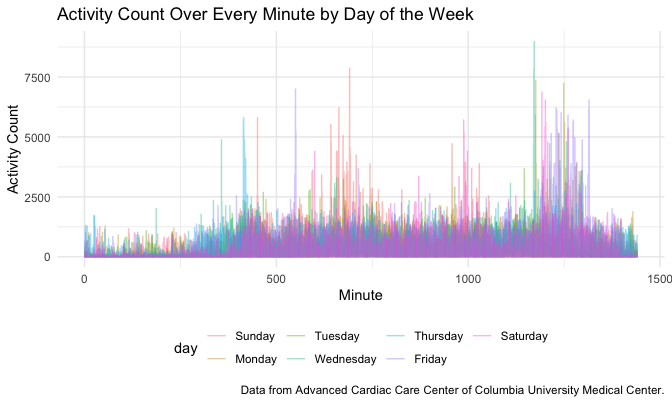

p8105_hw3_amz2148
================

Homework 3

# Problem 0

``` r
library(tidyverse) #loads tidyverse package
```

    ## ── Attaching packages ─────────────────────────────────────── tidyverse 1.3.2 ──
    ## ✔ ggplot2 3.3.6      ✔ purrr   0.3.5 
    ## ✔ tibble  3.1.8      ✔ dplyr   1.0.10
    ## ✔ tidyr   1.2.0      ✔ stringr 1.4.1 
    ## ✔ readr   2.1.3      ✔ forcats 0.5.2 
    ## ── Conflicts ────────────────────────────────────────── tidyverse_conflicts() ──
    ## ✖ dplyr::filter() masks stats::filter()
    ## ✖ dplyr::lag()    masks stats::lag()

``` r
knitr::opts_chunk$set(echo = TRUE) #shows all code chunks
knitr::opts_chunk$set(
  fig.width = 6,
  fig.asp = .6,
  out.width = "90%")

theme_set(theme_minimal() + theme(legend.position = "bottom"))
```

# Problem 1

# Problem 2

First, we load, tidy, and otherwise wrangle the data. The final dataset
includes all originally observed variables and values; has useful
variable names; includes a weekday vs weekend variable; and encodes data
with reasonable variable classes.

``` r
activity = 
  read_csv("data/accel_data.csv") %>% #loads csv file
  janitor::clean_names() %>% #cleans variable names
    pivot_longer(
    activity_1:activity_1440,
    names_to = "minute", 
    values_to = "activity_lvl") %>% #tidies data into long format
  mutate(day_type = case_when(day == "Saturday" | day == "Sunday" ~ "weekend", day != "Saturday" | day == "Sunday" ~ "weekday")) %>% #creates day_type variable
  mutate(minute = gsub("[A-z]","",minute))  %>% #removes "activity_" prefix from minute variable
  mutate(day = as.factor(day), day_type = as.factor(day_type), minute = as.numeric(minute)) %>% #converts character variables to factor or dbl
  select(week, day_id, day, day_type, minute, activity_lvl) %>% #reorders columns
  arrange(week, day_id, minute) #arranges data by certain observations
```

    ## Rows: 35 Columns: 1443
    ## ── Column specification ────────────────────────────────────────────────────────
    ## Delimiter: ","
    ## chr    (1): day
    ## dbl (1442): week, day_id, activity.1, activity.2, activity.3, activity.4, ac...
    ## 
    ## ℹ Use `spec()` to retrieve the full column specification for this data.
    ## ℹ Specify the column types or set `show_col_types = FALSE` to quiet this message.

In the resulting dataset, there are `50400` rows (observations) and `6`
variables. The variables’ names are
`week, day_id, day, day_type, minute, activity_lvl`. The `week` variable
assigns a numeric value to which week the observation is from, ranging
from `1` to `5`. The `day_id` variable assigns a numeric value to which
day the observation is from, ranging from `1` to `35`. The `day`
variable states the day of the week associated with the observation and
`day_type` states whether the observation occurred on a weekday or
weekend. The `minute` variable shows what minute of the day the
observation is from, ranging from `1` (starting at midnight) to `1440`
(just before midnight). Finally, the `activity_lvl` variable (with a
median value of `74`) gives the activity count associated with each
observation as measured by the accelerometer.

Traditional analyses of accelerometer data focus on the total activity
over the day. Using the tidied dataset, we aggregate across minutes to
create a total activity variable for each day, and create a table
showing these totals.

``` r
activity %>% 
  mutate(day = factor(day, levels = c("Sunday", "Monday", "Tuesday", "Wednesday", "Thursday", "Friday", "Saturday"))) %>% 
  group_by(week, day) %>% 
  summarize(
    total_activity = sum(activity_lvl)) %>% 
  pivot_wider(
    names_from = "day", 
    values_from = "total_activity") %>% 
  knitr::kable(digits = 0)
```

    ## `summarise()` has grouped output by 'week'. You can override using the
    ## `.groups` argument.

| week | Sunday | Monday | Tuesday | Wednesday | Thursday | Friday | Saturday |
|-----:|-------:|-------:|--------:|----------:|---------:|-------:|---------:|
|    1 | 631105 |  78828 |  307094 |    340115 |   355924 | 480543 |   376254 |
|    2 | 422018 | 295431 |  423245 |    440962 |   474048 | 568839 |   607175 |
|    3 | 467052 | 685910 |  381507 |    468869 |   371230 | 467420 |   382928 |
|    4 | 260617 | 409450 |  319568 |    434460 |   340291 | 154049 |     1440 |
|    5 | 138421 | 389080 |  367824 |    445366 |   549658 | 620860 |     1440 |

A table of total activity for each day reveals a few possible trends.
The days toward the middle of each week (Tuesday, Wednesday, and
Thursday) have fairly consistent, middle-of-the-range total activity
levels (around 400,000 units per day). Meanwhile, the days at/around the
weekend (Friday - Monday) have more variable total activity levels
ranging from both very high (\>600,000 units) to very low (around or
less than 100,000 units). There are also a few days when likely no
activity occurred (Saturday of weeks 4 and 5), evidenced by the fact
that the total activity level was equal to 1440, which is the value
outputted when every minute of the day had an activity level of 1. This
may mean the individual was not wearing the accelerometer and thus this
could be erroneous data. Furthermore, each week with the exception of
week 4 has one day with an activity level above 600,000 units -
suggesting that the day on which the individual may have not worn the
device that week (Saturday) is the missing “highly active day” of this
week (though this is by no means proven by the data).

Finally, we create a single-panel plot that shows the 24-hour activity
time courses for each day and uses color to indicate day of the week.

``` r
activity %>% 
  mutate(day = factor(day, levels = c("Sunday", "Monday", "Tuesday", "Wednesday", "Thursday", "Friday", "Saturday"))) %>% 
  group_by(day, minute) %>% 
  ggplot(aes(x = minute, y = activity_lvl)) + 
    geom_line(aes(color = day), alpha = .4) +
    theme(legend.position = "bottom") +
  labs(
    title = "Activity Count Every Minute by Day of the Week",
    x = "Minute",
    y = "Activity Count",
    caption = "Data from Advanced Cardiac Care Center of Columbia University Medical Center.")
```



Based on this graph, one can see that most activity count values are
fairly low, generally below \~2000 units each minute. There is also
lower activity seen in the early parts of the day (before around minute
500). There are spikes throughout the day, but these are primarily
clustered around the middle of the day (\~minute 700) and in the evening
(\~minute 1250). Furthermore, when examining these aforementioned
clustered spikes, we can see many noon spikes on Sundays and many
evening spikes on Fridays. Meanwhile, other smaller patterns are visible
as well, such as consistent medium-level spiking on Saturdays around
minute 1000. These patterns could offer clues about the individual’s
daily habits and activities. For example, it is possible that the
individual usually goes out on Friday nights and walks to lunch on
Sundays. However, is seems less likely that the individual walks/cycles
to work every day as there are no consistent weekday spikes around 9am
(minute 540) and 5pm (1000), but perhaps the person does so on some
days, since a few spikes are seen around those values. But to know
detailed information such as this, we would need to know more about the
person’s activities, as the graph can only provide suggestions but not
definitive conclusions, since many other variables could be contributing
to the trends we see.
